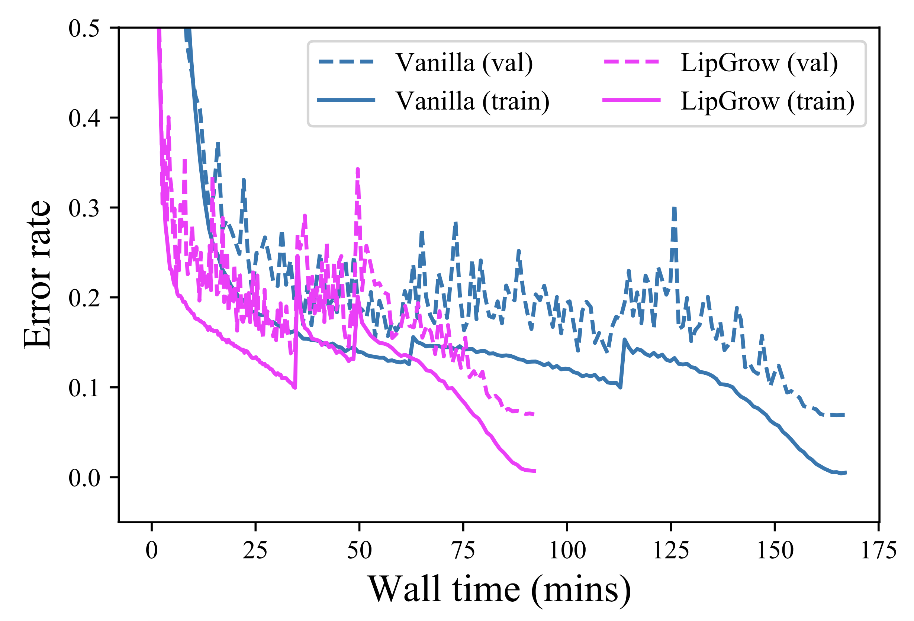

# LipGrow
An adaptive training algorithm for residual network based on model Lipschitz

* Our algorithm reduces about 50% time when training ResNet-74 on CIFAR-10
<p align="center"></p>

## Install
* Install [PyTorch](http://pytorch.org/)
* Clone recursively
  ```
  git clone --recursive https://github.com/shwinshaker/LipGrow.git
  ```

## Setup
* By default, build a `./data` directory which includes the datasets 
* By default, build a `./checkpoints` directory to save the training output

## Training
* CIFAR-10/100
  ```
  ./launch.sh
  ```
* Tiny-ImageNet
  ```
  ./imagenet-launch.sh
  ```

## Issues
* ResNet architecture for ImageNet is slightly from the published one. The uneven blocks in every subnetworks requires different grow scheduler for each subnetwork, which requires some extra work

## Citation

If you find our algorithm helpful, consider citing our paper
> [Towards Adaptive Residual Network Training: A Neural-ODE Perspective](https://proceedings.icml.cc/static/paper_files/icml/2020/6462-Paper.pdf)

```
@inproceedings{Dong2020TowardsAR,
  title={Towards Adaptive Residual Network Training: A Neural-ODE Perspective},
  author={Chengyu Dong and Liyuan Liu and Zichao Li and Jingbo Shang},
  year={2020}
}
```
